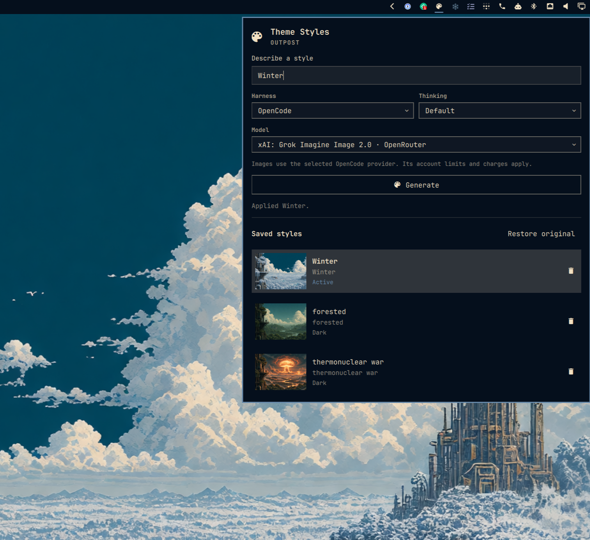
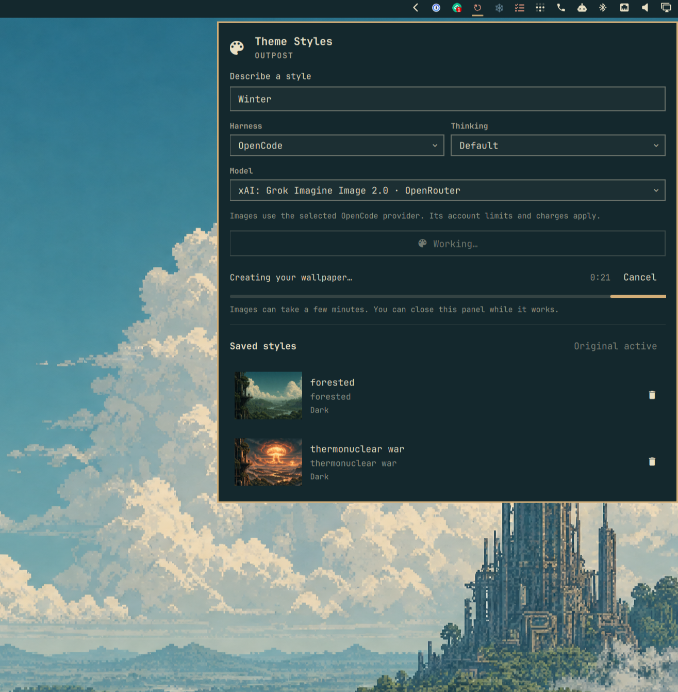

# Theme Styles

An Omarchy bar plugin for making winter, summer, moonlit, or custom versions of
your current theme. An agent generates the wallpaper; [Aether](https://github.com/omacom/aether)
creates matching application colors. Saved styles stay with their original theme
and do not appear as separate entries in Omarchy's theme picker.



## Install

Requires Omarchy Quattro (tested on 4.0.4), Python 3.11+, Aether, ImageMagick,
Bubblewrap with `--tmp-overlay` support, and a signed-in agent. Install these
separately; `python3`, `aether`, `magick`, `bwrap`, and `omarchy` must be on your
PATH. Desktop error notifications use `notify-send`.

```sh
omarchy plugin add https://github.com/erikwb/themestyles --enable
```

## Use

Open the palette icon in the bar, describe a style, choose a harness and model,
and press **Generate**. The description becomes its name; repeated descriptions
get a number, such as `Winter 2`.

- Generation runs in the background. The panel shows progress and a Cancel button.
- For themes with several wallpapers, generation uses the one currently selected.
  Each saved style retains its source wallpaper for future variations.
- The result applies automatically if the theme and wallpaper haven't changed.
  Otherwise, it is saved for the original theme.
- Click a saved style to apply it. This does not call an agent.
- The trash button asks for confirmation. Deleting the active style restores
  the original appearance first.
- **Restore original**, or selecting the theme in Omarchy again, restores its
  original appearance. Saved styles remain available here.
- Errors are selectable. **Copy log path** copies the path to the most recent
  generation log.

App colors automatically preserve the original theme's light/dark mode.



## Agents

The harness picker detects installed, signed-in Codex, Grok, Claude Code, Pi,
OpenCode, Muse, Gemini, Copilot, Cursor, Oh My Pi, Hermes, OpenClaw, and Crush.
It does not install agents or test image generation during discovery. Reopen
the panel after signing in or out.

Models and thinking levels come from each adapter's available catalog or settings.
**Harness default** and **Default** leave the choice to the harness when its
adapter cannot enumerate options. Selections are saved separately for each theme.
Changing harness resets the model and thinking level; changing model resets thinking.

OpenCode supports OpenRouter, Zen, and Go connections. OpenRouter models come
from its live image catalog. Zen and Go models come from `opencode models
--verbose` and must explicitly advertise both image input and image output, using
a supported Google, OpenAI, or OpenAI-compatible SDK. Each model's label includes
its provider. Zen/Go thinking levels follow OpenCode's catalog; OpenRouter's image
API uses **Default**.

Zen and Go currently advertise no image-output models. If their catalogs add
compatible ones, they will appear when the panel is reopened. Discovery reads
OpenCode's refreshed model cache without changing it. These paths use
OpenCode's existing SDK, credentials, endpoint and headers, and capture inline
PNG, JPEG, or WebP results from Gemini, Chat Completions or Responses. They do not
guess a separate image endpoint. A new protocol or URL-only image response would
still require adapter support. An image capability flag cannot guarantee that an
account or subscription permits generation.

The adapters load only in Theme Styles' sandboxed OpenCode processes through
`OPENCODE_CONFIG_CONTENT`. They do not change OpenCode configuration, install
packages, or affect normal sessions. Only one generation request is allowed per
job. A failed OpenRouter catalog fetch does not hide eligible Zen or Go models.
Other harnesses use their existing image tools and catalogs.

Image generation depends on the harness's existing tools, extensions, permissions,
and account limits. A failed attempt shows an error and preserves the current style.
It does not switch to another harness or install a missing image tool.

Account discovery errors appear in the panel separately from signed-out accounts.
Custom provider variables explicitly referenced in harness configuration are passed
to generation; unrelated environment variables are excluded.

These integrations are experimental. Discovery has been checked on live Codex,
Grok, Claude Code, Pi, and OpenCode installations. OpenCode image requests are
tested with OpenCode 1.18.31 and local mock services, without paid generation.
Zen and Go have not been tested against subscribed accounts.
The other adapters have fixture tests but still need testing with signed-in
installations. Stored credentials can expire, so some login failures are only
detected when generating.

## Files and privacy

The wallpaper and style prompt go to the selected agent and its image service.
Generation may use paid account credits.

Styles, original snapshots, prompts, and logs live in
`$XDG_DATA_HOME/omarchy-theme-styles`, normally `~/.local/share/omarchy-theme-styles`.
Inspect logs before sharing them: they may contain prompts and agent output.
The store is restricted to your user. Failed jobs retain their prompts and logs
for troubleshooting. Each process's combined stdout/stderr is capped at 16 MiB;
exceeding this stops the process with an error.
Damaged saved-style records are reported individually while other styles remain usable.

Agents run in a Bubblewrap sandbox with a private home, temporary configuration
for the selected harness, and a 512 MiB temporary output filesystem. Only named,
validated results are copied back; scratch files are discarded. Your desktop sockets,
unrelated home files, and saved themes are unavailable. The reference wallpaper
and generation instructions are read-only. If the sandbox cannot start, generation
fails; there is no unrestricted fallback.

The agent still has network access and its configured provider credentials and
MCP tools. The sandbox cannot restrict what a remote service does with those
credentials. Tools needing other local files or desktop access may fail. Harness
configuration changes and refreshed login tokens inside the sandbox are discarded;
renew expired logins in the harness itself.

Image decoding and Aether run in separate sandboxes without network access.
Only PNG, JPEG, WebP, and BMP inputs are accepted, with byte, dimension, memory,
disk, and time limits. Generated wallpapers are decoded and rewritten as PNG
before they become saved styles.

Each generation copies the active wallpaper before starting. If a saved style
is active, it uses that style's original source instead of editing the generated
image again. Switching wallpapers while a job runs does not change its source
or trigger automatic application when it finishes.

The original theme colors and application assets are snapshotted on the first
generation and retained across theme updates. Applying a style updates Omarchy's
runtime theme and calls its application refresh helpers and theme-set hook. The
installed theme source is never edited. Application settings outside Omarchy's
color templates retain their original styling.

## CLI

Run `theme-styles` from a source checkout or the installed plugin directory.
Commands return JSON. Use the current theme's `base` and saved style IDs from
`status` in place of the examples below.

```sh
./theme-styles status
./theme-styles agents
./theme-styles start --theme tokyo-night --style 'Winter dusk' --apply
./theme-styles apply --theme tokyo-night --id SAVED_STYLE_ID
./theme-styles restore --theme tokyo-night
./theme-styles delete --theme tokyo-night --id SAVED_STYLE_ID --yes
./theme-styles cancel --theme tokyo-night
```

Omit `--apply` to save without applying. Use IDs from `agents` with `--harness`,
`--model`, and `--thinking` to override the saved selection. `--name` supplies an
explicit saved name, which must be unique within the theme. Theme-sensitive
commands also accept `--token` from `status` to guard against a changed selection.

## Development

No build step or Python packages are required.

```sh
PYTHONDONTWRITEBYTECODE=1 python3 -m unittest discover -s tests -v
omarchy plugin validate .
```

Tests use temporary data and do not run paid generation. The native UI test
requires Omarchy on Wayland and QtTest; it is skipped without that desktop environment.
For live UI development, edit the installed checkout at
`~/.config/omarchy/plugins/io.weirdware.themestyles`. Omarchy reloads plugin files
when they change.

## Uninstall

Restore the original theme, then remove the plugin:

```sh
omarchy theme set "$(cat ~/.local/state/omarchy/current/theme.name)"
omarchy plugin remove io.weirdware.themestyles
```

Saved styles remain in the data directory so reinstalling recovers them.

## License

[MIT](LICENSE), Erik Bourget.
